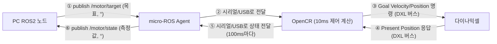

## 문제 1

### 설정

- 모터: 다이나믹셀 XM430-W350 (모델 1020), ID 12, Protocol 2.0, 1 Mbps
- 예제: `opencr_position_p` (Lv2 3강 제공 P 제어 소스)
- 게인: Kp = 0.5 (OpenCR 스케치의 위치 P 게인, Ki = Kd = 0)
- 속도 상한: 20°/s
- 목표각: +10° (상대각, 시작 위치 0°)

### 환경 및 업로드 확인

라즈베리파이(Ubuntu 22.04.5 LTS, hostname `pa22`)에서 SSH로 접속해 위 조건을 수행했다. OpenCR은 `/dev/ttyACM0`로 인식되었다 ([results/환경확인.txt](results/환경확인.txt)).

사전 빌드 펌웨어를 라즈베리파이에서 `opencr_ld`로 업로드했다. 업로드 로그에서 보드 인식(`Board Name : OpenCR R1.0`), flash 지우기·쓰기 성공, `CRC OK`, `[OK] Download`, `jump_to_fw`까지 확인했다 ([results/upload.log](results/upload.log)). 체크섬 일치만이 아니라 실제 업로드 도구가 끝까지 성공적으로 완료하고 펌웨어로 정상 점프한 것을 근거로 삼았다.

### 실행 A 기록

`s 0.5 20 10` 명령 전송 후 `START: current position = 0 deg.`와 설정 echo(`P SET Kp=0.5000, Ki=0.0000, Kd=0.0000, speed_limit_deg_s=20.000, angle_deg=10.000`)를 확인했다. 이후 100ms 주기로 측정값이 기록되었고, `x` 명령으로 수동 정지하여 `STOP: user`를 확인했다. 전체 기록은 [results/실행A.log](results/실행A.log) (98행, 목표 변경 이후 측정값 다수 확보).

### 목표값·측정값·제어출력 구분 (실행A 발췌)

| 경과시간 t_s | 목표값 target_deg [°] | 측정값 position_deg [°] | 오차 error_deg [°] | 제어출력 u_deg_s [°/s] |
|---|---|---|---|---|
| 2.000 | 10.000 | 0.000 | 10.000 | 5.496 |
| 4.000 | 10.000 | 6.152 | 3.848 | 1.374 |
| 6.000 | 10.000 | 8.701 | 1.299 | 0.000 |
| 9.001 | 10.000 | 8.789 | 1.211 | 0.000 |

- `target_deg`: 시작 위치(0°)를 기준으로 한 상대 목표각. 단위 °.
- `position_deg`: 다이나믹셀 엔코더(Present Position)에서 계산한 상대 현재각. 단위 °.
- `u_deg_s`: OpenCR이 다이나믹셀에 실제로 써준 Goal Velocity(휠 모드)를 각속도로 환산한 값 — 즉 이 실행에서의 제어 출력. 단위 °/s.

### 관찰 설명

목표를 10°로 바꾸자(t=2.0s) 위치가 즉시 증가하기 시작해 8.7~8.8° 부근까지 접근했으나, 남은 오차(약 1.2~1.3°)에 대한 P 제어 출력이 다이나믹셀 속도 명령의 최소 분해능보다 작아 반올림되어 0이 되면서 더 이상 움직이지 않고 목표에 완전히 도달하지 못한 채 멈췄다. 이후 `x` 명령으로 즉시 정지되는 것을 확인했다.

## 문제 2

### 오차 표 (실행A 재사용)

| 시점 | 목표각 target_deg [°] | 현재각 position_deg [°] | 오차 = 목표각 − 현재각 [°] |
|---|---|---|---|
| 초기 (t=2.000s, 목표 변경 직후) | 10.000 | 0.000 | 10.000 |
| 중간 (t=5.000s) | 10.000 | 7.559 | 2.441 |
| 마지막 (t=9.001s, 정지 직전) | 10.000 | 8.789 | 1.211 |

### 오차 크기 변화 설명

목표가 바뀐 직후 오차는 10°로 가장 크고, 중간 시점(t=5.0s)까지는 P 제어 출력(오차에 비례한 속도 명령)이 충분히 커서 빠르게 줄어든다(2.441°). 그러나 오차가 더 작아질수록 명령 속도도 함께 작아지다가, 다이나믹셀 Goal Velocity의 최소 분해능(raw 1단위 ≈ 0.229 rev/min) 아래로 내려가면 명령이 0으로 반올림되어 더 이상 움직이지 않는다. 그 결과 마지막 시점에도 오차가 1.211°로 남아 0에 완전히 수렴하지 못한다 — 순수 P 제어의 정상상태 오차다.

### 센서·통신 경로

위치 측정값은 다이나믹셀 XM430-W350 내부의 절대 엔코더(Present Position, 4096 tick/rev)에서 얻는다. 이 값은 다이나믹셀의 half-duplex TTL 직렬 버스(Protocol 2.0)를 통해 OpenCR의 DXL 포트(Serial3)로 전달된다. OpenCR에서 실행 중인 Dynamixel2Arduino 라이브러리가 READ 인스트럭션 패킷을 보내 PRESENT_POSITION 값을 응답받아 파싱하고(`readControlTableItem`), 스케치가 이를 시작 위치 기준 상대각(`position_rad`/`position_deg`)으로 변환한다. 이렇게 얻은 현재각이 목표각과 비교되어 오차가 계산되고, 그 오차로부터 나온 속도 명령이 다시 같은 버스를 통해 다이나믹셀의 Goal Velocity로 전달된다.

### 예시: 목표 +30°, 현재각 +35°인 경우

오차 = 30 − 35 = **−5°로 음수**다. 양의 Kp를 곱하면 제어 출력(목표 각속도)도 음수가 되므로, 다이나믹셀은 현재각이 줄어드는 방향(35°→30° 쪽, 목표를 넘어선 만큼 되돌아오는 방향)으로 회전하도록 명령을 받는다.

## 문제 3

### A·B 설정

목표각·속도 상한·부하(모터 단독, 무부하)·측정 주기(10ms 제어/100ms 로그)는 A·B 동일하게 유지하고 Kp만 바꿨다.

| 실행 | Kp | Ki | Kd | 속도 상한 | 목표각 | 기록 |
|---|---|---|---|---|---|---|
| A | 0.5 | 0 | 0 | 20°/s | +10° | [results/실행A.log](results/실행A.log) |
| B | 3.0 | 0 | 0 | 20°/s | +10° | [results/실행B.log](results/실행B.log) |

### 같은 경과시간 비교

| 경과시간 t_s | A 현재각 [°] | A 오차 [°] | A 목표초과 | B 현재각 [°] | B 오차 [°] | B 목표초과 |
|---|---|---|---|---|---|---|
| 2.000 | 0.000 | 10.000 | 아니오 | 0.000 | 10.000 | 아니오 |
| 3.000 | 3.428 | 6.572 | 아니오 | 9.580 | 0.420 | 아니오 |
| 4.000 | 6.152 | 3.848 | 아니오 | 9.844 | 0.156 | 아니오 |
| 9.001 | 8.789 | 1.211 | 아니오 | 9.844 | 0.156 | 아니오 |

### 해석

Kp가 클수록(B=3.0) 같은 오차에서 나오는 명령 속도(`p_deg_s = Kp × error`)가 더 커서 목표 각속도가 속도 상한(20°/s)에 훨씬 빨리 도달하고, 그 결과 t=3.0s 시점에 이미 오차가 0.420°까지 줄어든다. 반면 A(Kp=0.5)는 같은 시점에 오차가 6.572°로 15배 이상 크게 남아, 수렴 속도 차이가 뚜렷하게 나타난다.

두 실행 모두 목표를 넘어서는 오버슈트는 관찰되지 않았다. Ki=Kd=0인 순수 P 제어에서는 명령 속도가 오차에 비례해 목표에 가까워질수록 자연히 줄어들기 때문에, 이번 실행 조건(무부하, 20°/s 상한)에서는 관성에 의한 오버슈트가 나타날 정도로 빠르게 감속이 늦춰지지 않았다.

두 실행 모두 정상상태 오차가 완전히 0으로 수렴하지는 않았다(A: 1.2~1.3°, B: 0.156°). 다만 Kp가 클수록 같은 잔여 오차에서도 명령 속도가 다이나믹셀 속도 분해능 이상으로 유지되는 구간이 넓어져, B의 정상상태 오차가 A보다 훨씬 작게 남았다.

### 게인의 위치 구분과 I·D의 역할

이번에 바꾼 Kp는 **OpenCR 스케치가 소프트웨어로 계산하는 위치 제어 게인**이며, 다이나믹셀 내부의 Position P Gain(내부 위치 PID)과는 다르다. 이 예제는 다이나믹셀을 Velocity(휠) 모드로 구동해 다이나믹셀 내부에는 속도 PI만 사용하고, 내부 위치 PID는 아예 쓰지 않는다.

- I항(적분): 시간에 따라 누적된 오차를 반영해 P 제어에서 남는 정상상태 오차를 제거하는 역할을 한다.
- D항(미분): 오차의 변화율에 비례해 제동을 걸어 오버슈트와 진동을 억제하고 응답을 더 빠르게 안정시키는 역할을 한다.

## 문제 4

이 문항은 발제문에 주어진 가상 기록(실제 실행 결과 아님)만으로 구조와 주기를 해석한다. 새 실행이나 micro-ROS 구축은 하지 않았다.

### 구조도 — 목표 전달과 측정값 반환 경로

①~③은 목표를 내려보내는 경로, ④~⑥은 측정값을 되돌리는 경로다.

### 송수신 주체

- **PC ROS2 노드**: `/motor/target`에 목표값을 publish(송신)하고, `/motor/state`를 subscribe(수신)해 기록한다.
- **micro-ROS Agent**: PC의 ROS2/DDS 토픽과 OpenCR의 시리얼(USB) 통신을 서로 중계만 한다 — 값을 직접 만들거나 해석하지 않는다.
- **OpenCR**: Agent로부터 받은 목표값으로 10ms마다 제어를 계산해 다이나믹셀에 명령을 보내고(송신), 다이나믹셀의 현재값을 읽어(수신) 100ms마다 상태로 다시 내보낸다(송신).
- **다이나믹셀**: OpenCR의 명령을 받아 구동하고(수신), 엔코더 값을 응답한다(송신).

### 상태 발행 한 주기 동안의 제어 계산 횟수

제어 계산은 10ms마다, 상태 발행은 100ms마다 수행되므로: 100ms ÷ 10ms = **10회**. 즉 PC가 `/motor/state`를 한 번 받는 사이 OpenCR 내부에서는 제어 계산이 10번 이루어진다.

### 통신 단절 시 오래된 명령 처리 정책

**정책**: 마지막 목표값 수신 후 일정 시간(예: 100ms) 동안 새 명령이 오지 않으면, 오래된 목표를 계속 유지하지 않고 속도 0으로 자동 정지한다.

**근거**: 이번 과제에서 실제로 사용한 `opencr_position_p.ino`와 개인 테스트용 `opencr_wheel_test.ino` 모두 다이나믹셀의 `BUS_WATCHDOG` 기능을 켜 두었다 — 정해진 시간 안에 새 인스트럭션이 오지 않으면 다이나믹셀 자체가 하드웨어적으로 속도를 0으로 만든다. 통신이 끊겼는지를 매 제어 주기마다 소프트웨어로 따로 판단하기보다, 마지막으로 받은(어쩌면 오래된) 목표값을 계속 실행하다가 로봇이 의도치 않게 계속 움직이는 상황을 막는 것이 더 안전하고, 이미 하드웨어 차원에서 보장되므로 별도 로직보다 신뢰성이 높다.
